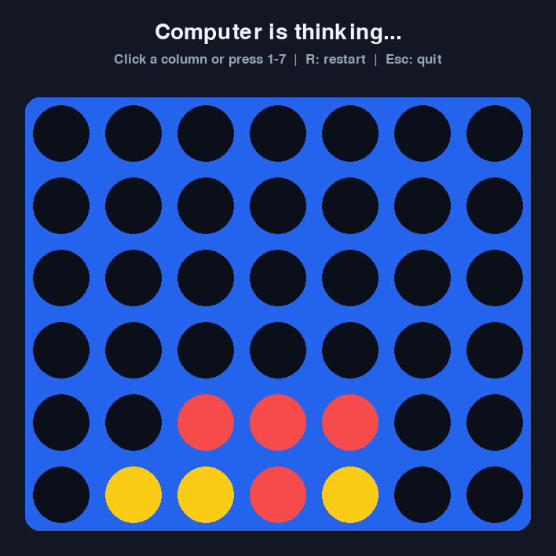

# Connect Four

A graphical Connect Four game written in Python with Pygame. Play locally against another person or against a simple computer opponent.

This project began as a first-year Computer Engineering assignment and was later reorganized as a standalone project. The public version separates the game rules from the graphical interface and includes automated tests.



## Features

- Local two-player mode
- Player-versus-computer mode
- Detection of horizontal, vertical and diagonal wins
- Computer player that can win, block threats and prioritize the center
- Mouse and keyboard controls
- Random or configurable starting player
- Restart without closing the application
- Unit tests for the core game rules

## Requirements

- Python 3.10 or newer
- Pygame 2.5 or newer

## Installation

```bash
python -m venv .venv
```

Activate the virtual environment:

```bash
# Windows
.venv\Scripts\activate

# macOS or Linux
source .venv/bin/activate
```

Install the dependency:

```bash
python -m pip install -r requirements.txt
```

## Running the game

Play against the computer:

```bash
python connect_four.py
```

Play against another person:

```bash
python connect_four.py --mode human
```

Choose who starts:

```bash
python connect_four.py --first player1
python connect_four.py --first player2
python connect_four.py --first random
```

## Controls

- Click a column or press keys `1` to `7` to place a piece.
- Press `R` to restart.
- Press `Esc` to quit.

## Tests

The game rules do not depend on Pygame, so they can be tested separately:

```bash
python -m unittest discover -s tests -v
```

## Project structure

```text
connect_four/
|-- connect_four.py
|-- game_logic.py
|-- requirements.txt
|-- README.md
`-- tests/
    `-- test_game_logic.py
```

## Authors

- Xavier Montaner
- Víctor Murillo

The original university exercise used a course-provided Pygame view as a starting point. This public version reimplements the interface and preserves the game logic and lessons learned from the assignment.

## What we learned

- Representing a board with nested lists
- Separating game state from rendering
- Validating user moves
- Detecting winning patterns
- Implementing a rule-based computer opponent
- Testing game logic independently from a graphical interface
